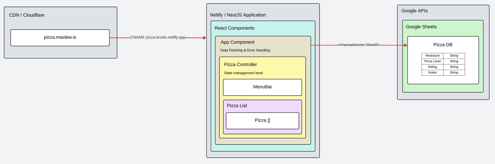

Pizza Levels is a ongoing list of margarita pizzas and their ratings.

## Basic Architecture


1. CDN Cloudflare CNAMES traffic to Netlify hosted NextJS App
2. NextJS App uses App router to request data from Google Sheets
3. NextJS App renders a Menu Bar and list of Pizzas with their reviews

## Getting Started

First, run the development server:

```bash
npm run dev
```

Open [http://localhost:3000](http://localhost:3000) with your browser to see the result.

### Unit Tests
There's a suite of unit tests against the low level components there should be 100% coverage of that level. These can be run with:

```bash
npm run test
```

App Router is new, and also new to me, so would be good to spend some time to figure out how to test the React Server components in page.tsx, error.tsx, layout.tsx that would bring the total project to 100% coverage.

## Deployment
Deployment is handled by netlify to the domain pizza.maxlew.is

## More things to do
- Swap Google Sheets out with a proper database
  - Although I do like how you get an 'editor' view for free with Sheets
- Add in some kind of middleware/caching layer between NextJS and Google Sheets
  - This would avoid a flood of requests all hitting the GSheets API and costing money
- Bring the GCP setup in here via terraform
  - Currently just clickopsed the API Key and configuration
